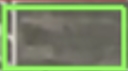
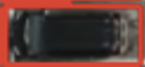
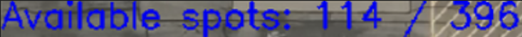

# Hệ thống phát hiện và đếm chỗ đỗ xe

## 1. Giới thiệu

Dự án phân tích video bãi đỗ xe, xác định từng ô đỗ là **trống** hay **có xe** rồi hiển thị trực tiếp lên video:

- Ô **xanh lá**: còn trống

- Ô **đỏ**: đã có xe

- Góc trên trái: `Available spots: <số ô trống> / <tổng số ô>`

Mỗi ô đỗ được cắt ra từ khung hình và đưa qua một mô hình CNN (PyTorch) để phân loại.

---

## 2. Bối cảnh và mục tiêu

- **Vấn đề:** tìm chỗ đậu xe trong các bãi đỗ lớn tốn thời gian và gây khó khăn cho tài xế.
- **Mục tiêu:** dùng học sâu để tự động phân loại, theo thời gian thực, từng vị trí đỗ xe thành 2 trạng thái: **Trống (Empty)** và **Có xe (Not Empty)**.
- **Ví dụ kết quả:** trên video demo, hệ thống hiển thị `Available spots: 114 / 396`, tức bãi có 396 ô và 114 ô còn trống tại thời điểm đó.

---

## 3. Luồng hoạt động

```
Đọc tọa độ ô đỗ (JSON hoặc mask PNG)
        │
        ▼
Chia bounding box cho từng ô đỗ (OpenCV)
        │
        ▼
Mỗi 30 frame: so sánh từng ô với frame trước, chọn ra các ô thay đổi vượt ngưỡng
        │
        ▼
Tiền xử lý ảnh các ô đã chọn, đưa vào mô hình phân loại
        │
        ▼
Gán nhãn empty / not_empty cho từng ô
        │
        ▼
Vẽ khung xanh/đỏ lên video và đếm số ô còn trống
```

**Giảm tải tính toán:** chạy CNN trên hàng trăm ô cho mỗi frame rất chậm. Vì vậy cứ mỗi 30 frame, chương trình tính độ chênh lệch giữa ô hiện tại và ô ở lần xử lý trước, và **chỉ phân loại lại những ô thay đổi đáng kể** (độ chênh lệch lớn hơn 40% so với ô thay đổi nhiều nhất). Các ô còn lại giữ nguyên trạng thái cũ. Lần xử lý đầu tiên thì phân loại toàn bộ các ô.

---

## 5. Cách xác định vị trí các ô đỗ

Có hai cách, chọn bằng biến `json_path` trong `main.py`:

- **Ảnh mask** (mặc định, `json_path = None`): ảnh nhị phân, vùng trắng là ô đỗ, mỗi vùng được tách thành một ô.
- **File JSON (LabelMe):** đặt `json_path` trỏ tới file nhãn; tọa độ được tự động scale theo kích thước video.

---

## 7. Dữ liệu và huấn luyện

**Dữ liệu**

| | Số ảnh |
|---|---|
| Tổng | 6090 |
| `empty` (trống) | 3045 |
| `not_empty` (có xe) | 3045 |
| Train (80%) | 4872 |
| Test (20%) | 1218 |

Dữ liệu cân bằng giữa hai lớp, được chia ngẫu nhiên với `seed = 42`.

**Tiền xử lý và augmentation**

| | Train | Test |
|---|---|---|
| Resize về 128×128 | ✔ | ✔ |
| Lật ngang ngẫu nhiên (p = 0.5) | ✔ | |
| Xoay ngẫu nhiên (±45°) | ✔ | |

**Cấu hình huấn luyện**

| Tham số | Giá trị |
|---------|---------|
| Epochs | 30 |
| Batch size | 32 |
| Optimizer | Adam (`lr = 1e-4`, `weight_decay = 1e-4`) |
| Loss | CrossEntropyLoss |
| Scheduler | ReduceLROnPlateau (giảm một nửa lr nếu test loss không cải thiện sau 3 epoch) |

**Theo dõi và lưu model:** loss, accuracy, precision, recall, F1 và đường cong PR được ghi vào TensorBoard (`tensorboard --logdir runs`). Model có test loss thấp nhất được lưu tại `model/best_cnn_model.pth`.

**Kết quả:** train accuracy và test accuracy đều trên 95%. Ở epoch 1, notebook ghi nhận `train_acc = 0.975` và `test_acc = 0.9992`.

---

## 10. Hướng phát triển

- Thêm Dropout trước lớp Linear để giảm overfit.
- Bổ sung dữ liệu ô đỗ có vật thể lạ hoặc ký hiệu lạ chèn lên.
- Xử lý đa luồng: tách thread đọc frame và thread chạy CNN.
- Xây dựng web dashboard để xem trạng thái bãi đỗ từ xa qua trình duyệt.
